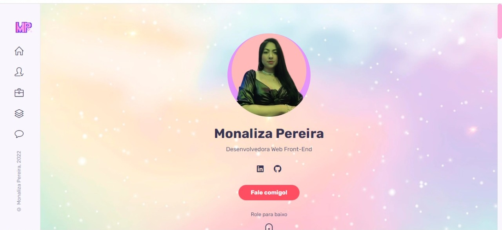

# Meu Portfólio - 💖

 
> 💖 <a href="https://monalizaps.github.io/cher-wardrobe">Acesse aqui</a> &nbsp; | &nbsp; 

## 💻 About

Página do meu Portfólio com alguns projetos que desenvolvi com muito amor 👩🏻‍💻

  

## 🧠 Techs

    
    
    
    

    

 

---

<table>
  <tr>
    <td>
      
    </td>
    <td>
    </td>
    <td>
      Feito por <a href="https://github.com/monaliza-pereira">Monaliza Pereira</a> 🔮
  </tr>
</table>
